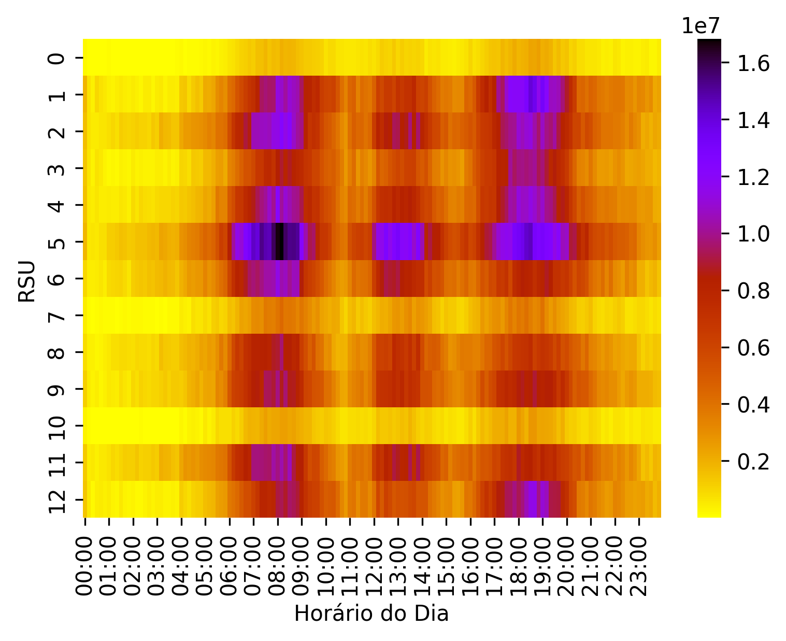
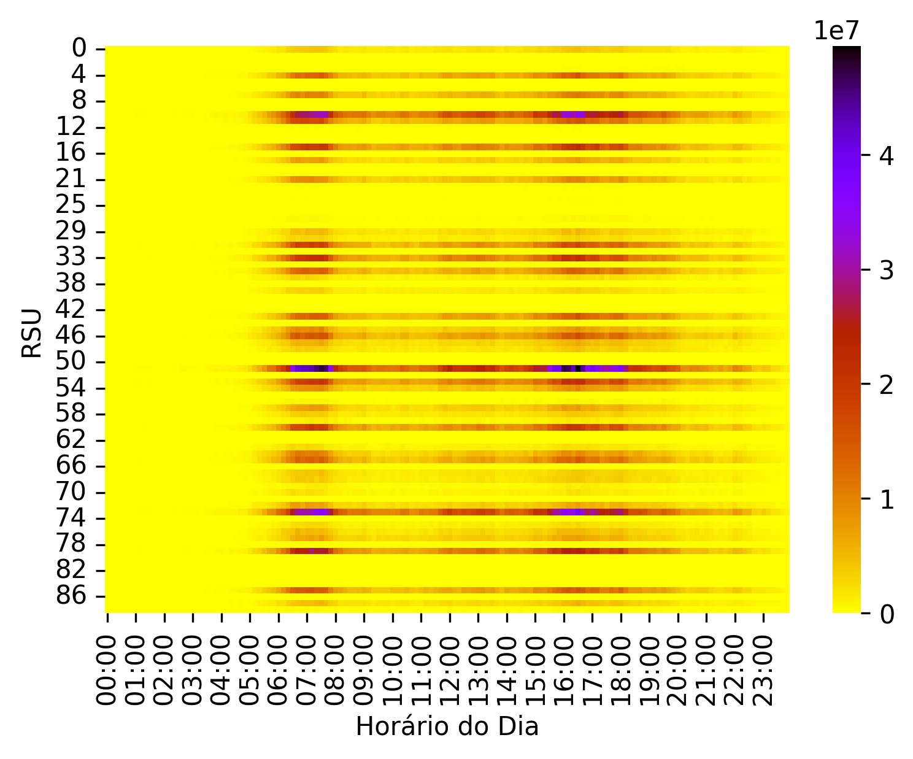
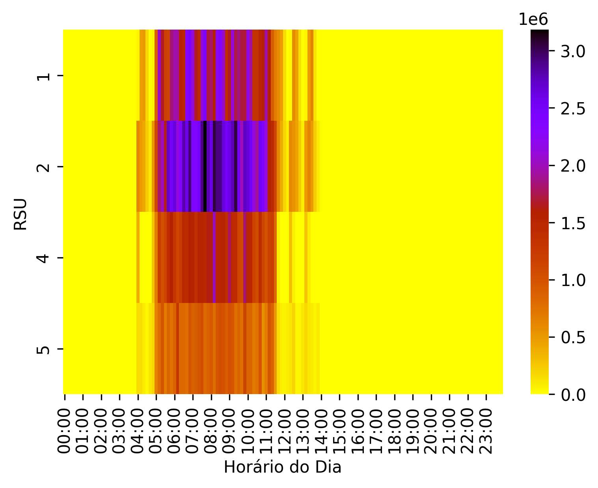
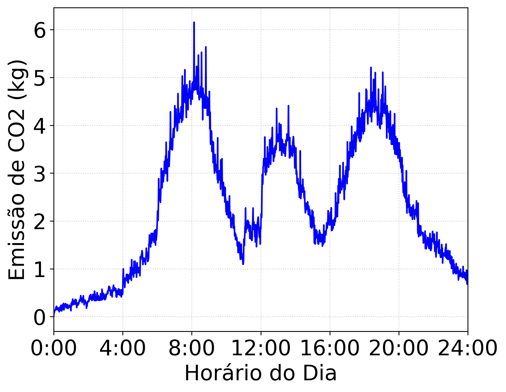
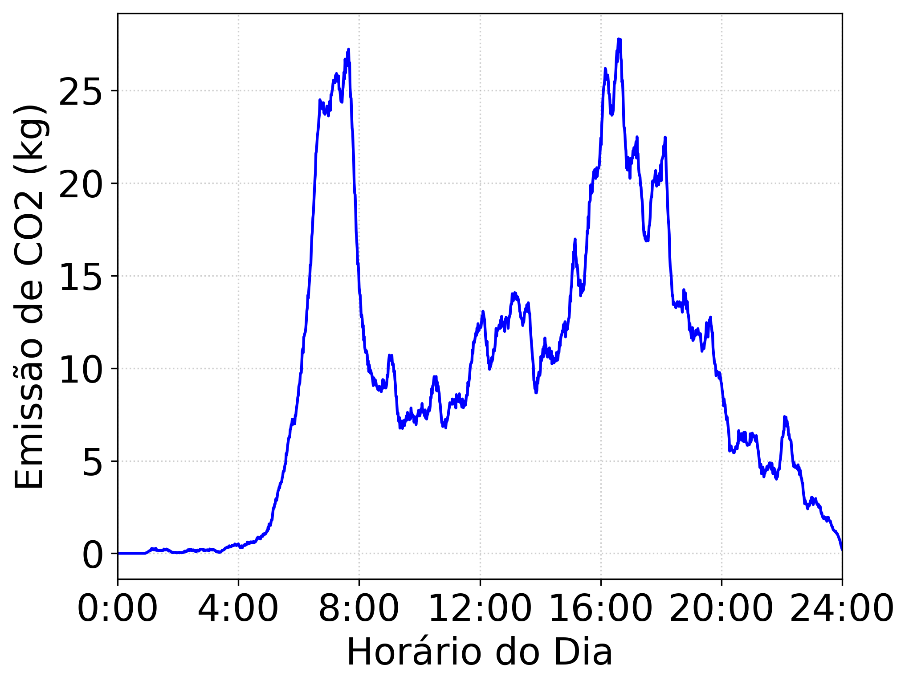
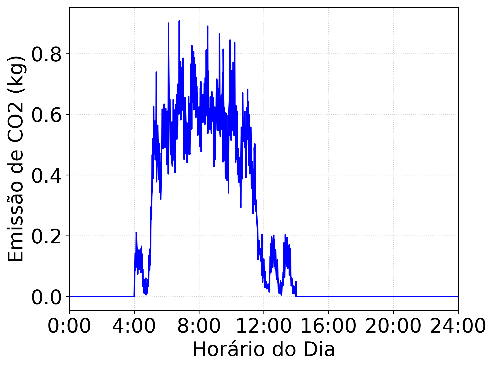

# CO2 Emission Analysis in Urban Environments using Roadside Units and SUMO Simulations
## Introduction
This repository contains the source code, scripts, and data used in the research project investigating traffic flow and CO2 emissions in urban environments. The project leverages Roadside Units (RSUs), SUMO traffic simulations, and machine learning techniques to analyze traffic patterns and their corresponding CO2 emissions.

## Timeseries 
LuST | Cologne | MoST
:-------------------------:|:-----------------------------------:|:-------------------------------:
 |  | 

## Heatmap
LuST | Cologne | MoST
:-------------------------:|:-----------------------------------:|:-------------------------------:
 |  | 
